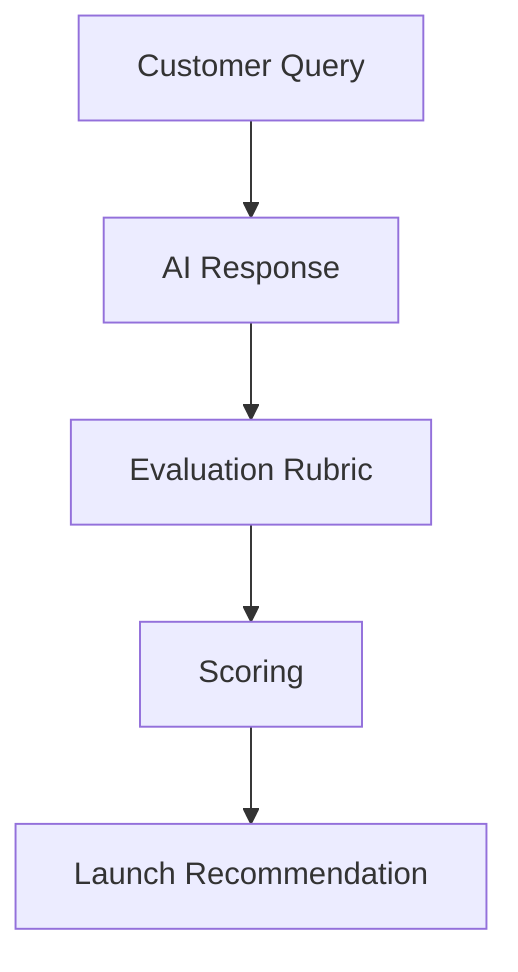
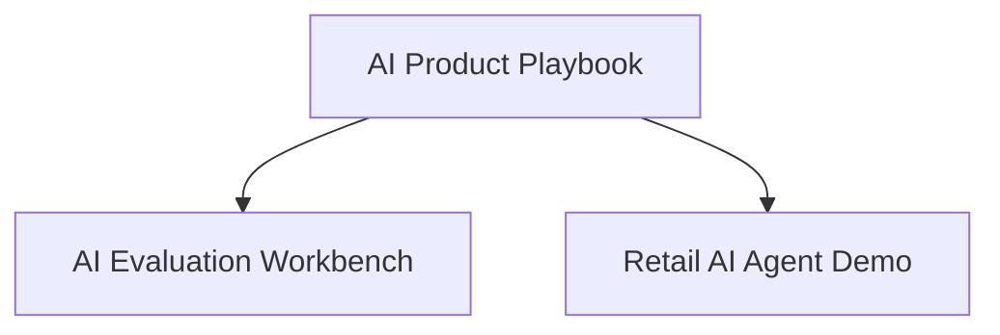

# AI Evaluation Workbench

> A practical evaluation toolkit for AI Product Managers to define, measure, and communicate AI quality before launch.

Building an AI feature is only half the job. The harder question is knowing **when it's good enough to launch**.

This repository provides a lightweight evaluation framework that helps product teams move beyond demos by measuring AI quality using synthetic scenarios, transparent scoring, and launch-oriented evaluation criteria.

---

## Start Here

This repository focuses on **Gate 2 — AI Quality** from the **AI Product Playbook**.

It demonstrates how AI Product Managers can define measurable quality before making launch decisions.



---

## Demo


---

## Why This Project Exists

AI demos often perform well on happy-path scenarios while failing on edge cases that matter most in production.

This workbench provides a structured way to evaluate AI responses before launch by combining synthetic test cases, human judgment, and transparent scoring criteria.

---

## What This Demonstrates

* Translating AI quality into measurable product metrics
* Designing evaluation plans for GenAI features
* Identifying failure modes before launch
* Connecting AI quality to product decisions
* Communicating trade-offs across Product, Engineering, Applied AI, and Risk teams

---

## Repository Contents

| Area                     | Purpose                                                      |
| ------------------------ | ------------------------------------------------------------ |
| **Product Brief**        | Defines the customer problem and evaluation objectives       |
| **Evaluation Plan**      | Establishes success criteria and testing methodology         |
| **Launch Decision Memo** | Documents launch recommendations based on evaluation results |
| **Failure Taxonomy**     | Classifies common AI failure modes                           |
| **Scoring Rubric**       | Defines evaluation dimensions and scoring criteria           |
| **Synthetic Test Cases** | Representative customer scenarios for evaluation             |
| **Scoring Engine**       | Calculates evaluation results                                |
| **Streamlit Demo**       | Interactive evaluation interface                             |

---

## Evaluation Dimensions

The workbench evaluates AI responses across five core dimensions:

| Dimension               | Why It Matters                                         |
| ----------------------- | ------------------------------------------------------ |
| **Correctness**         | Is the response factually accurate?                    |
| **Policy Compliance**   | Does it follow defined business policies?              |
| **Escalation Behavior** | Does it recognize when human intervention is required? |
| **Helpfulness**         | Does it solve the customer's problem effectively?      |
| **Safety**              | Does it avoid harmful or inappropriate responses?      |

The scoring framework is intentionally simple and transparent. It is designed to support product decisions—not replace human judgment.

---

## Example Launch Criteria

An AI feature should not progress to broader rollout until it meets predefined quality thresholds, for example:

* Average evaluation score ≥ **4.0 / 5**
* No critical policy compliance failures
* Escalation behavior validated for high-risk scenarios
* Failure modes documented and reviewed
* Human evaluation completed for critical customer journeys

---

## Running the Demo

### macOS / Linux

```bash
python3 -m venv .venv
source .venv/bin/activate
pip install -r requirements.txt
python evals/scoring.py
streamlit run app/app.py
```

### Windows (PowerShell)

```powershell
python -m venv .venv
.venv\Scripts\Activate.ps1
pip install -r requirements.txt
python evals/scoring.py
streamlit run app/app.py
```

---

## Where This Fits

This repository implements the AI quality evaluation methodology described in the **AI Product Playbook**.



---

## Related Projects

| Repository                                                                            | Purpose                                                                                     |
| ------------------------------------------------------------------------------------- | ------------------------------------------------------------------------------------------- |
| **[AI Product Playbook](https://github.com/sadasib/ai-product-playbook)**             | Frameworks, templates, and operating models for building and launching AI products.         |
| **[Retail AI Agent Demo](https://github.com/sadasib/retail-ai-agent-synthetic-demo)** | Demonstrates how the evaluation framework can be applied to a realistic retail AI use case. |

---

## Roadmap

Current Version

* Synthetic evaluation framework
* Transparent scoring rubric
* Failure taxonomy
* Interactive Streamlit demo

Planned Improvements

* Risk-weighted scoring
* Prompt and model version comparison
* Human reviewer workflow
* Cost and latency analysis
* Launch readiness dashboard
* Automated evaluation reports

---

## Disclaimer

This repository is a personal portfolio project created for learning and knowledge sharing.

All examples use synthetic data and publicly available concepts. Nothing in this repository contains confidential information or represents the views of my employer in anyway.
