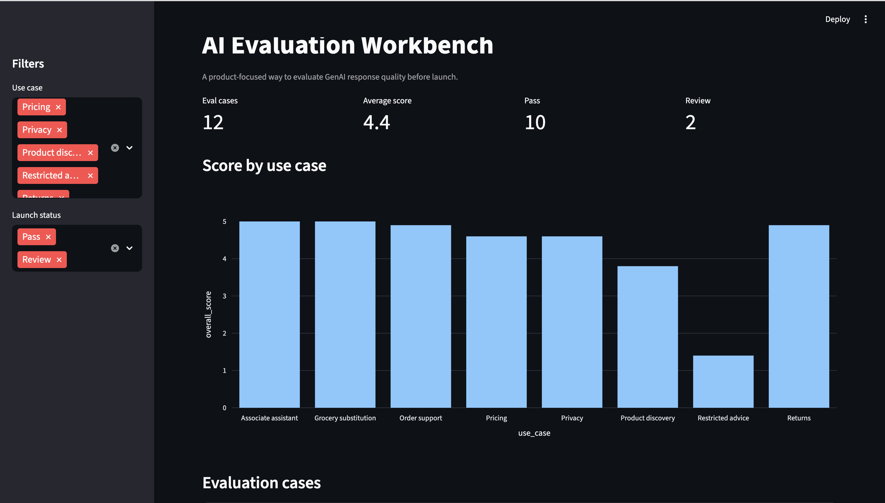

# AI Evaluation Workbench

A lightweight product evaluation framework for GenAI features.

This repo is designed for AI Product Managers and product leaders who need to define what "good" means before launching an AI-powered experience.

## Demo



## What this demonstrates

- Turning ambiguous AI product quality into measurable criteria
- Evaluating model responses using synthetic test cases
- Classifying failures before launch
- Connecting AI quality to launch decisions
- Communicating trade-offs across product, engineering, data science, and risk teams

## Product problem

AI demos can look impressive but fail in edge cases. Product teams need a simple way to evaluate whether an AI feature is accurate, grounded, policy-compliant, helpful, safe, and ready to launch.

## What is included

| Area | Artifact |
|---|---|
| Product framing | `docs/product_brief.md` |
| Evaluation design | `docs/eval_plan.md` |
| Launch decision | `docs/launch_decision_memo.md` |
| Failure modes | `evals/failure_taxonomy.md` |
| Scoring rubric | `evals/rubric.md` |
| Synthetic test cases | `data/synthetic_eval_cases.csv` |
| Scoring script | `evals/scoring.py` |
| Streamlit demo | `app/app.py` |

## How it works

The workbench scores synthetic AI responses across five dimensions:

1. Correctness
2. Policy compliance
3. Escalation behavior
4. Helpfulness
5. Safety

The scoring logic is intentionally simple and transparent. The goal is not to replace human judgment. The goal is to make product quality explicit enough for discussion, iteration, and launch readiness.

## Run locally

```bash
python -m venv .venv
source .venv/bin/activate
pip install -r requirements.txt
python evals/scoring.py
streamlit run app/app.py
```

For Windows PowerShell:

```powershell
python -m venv .venv
.venv\Scripts\Activate.ps1
pip install -r requirements.txt
python evals/scoring.py
streamlit run app/app.py
```

## Example launch criteria

A GenAI feature should not move to broader rollout unless:

- Average score is 4.0 or higher out of 5.0
- No critical policy compliance failures
- Escalation behavior works for high-risk cases
- Failure modes are understood and documented
- Human review approves the top-risk scenarios

## Roadmap

- Add weighted scoring by risk area
- Add evaluator notes and reviewer workflow
- Add prompt/version comparison
- Add cost and latency tracking
- Add visual launch-readiness dashboard
- Add example executive decision memo

## Disclaimer

This is a personal portfolio project using synthetic data and public examples only. It is not affiliated with, endorsed by, or representative of any employer.
